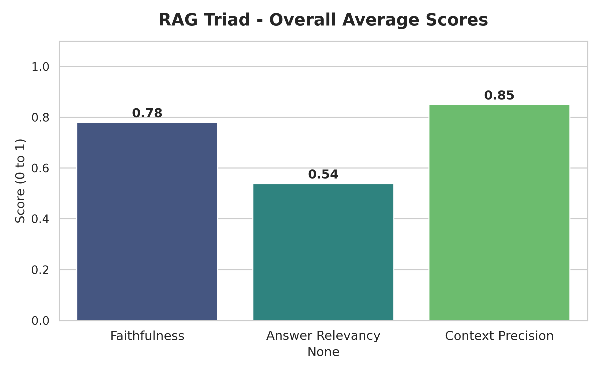
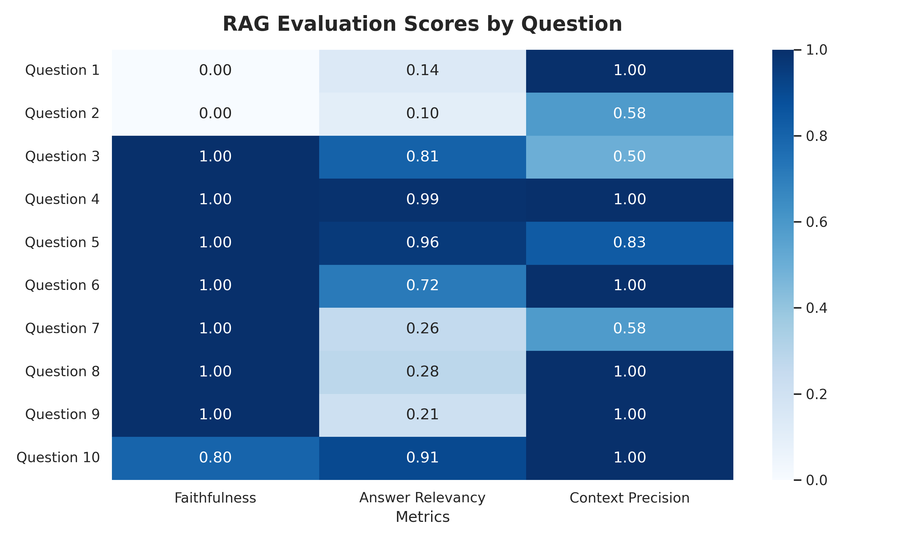

# 📄 Enterprise Policy RAG System & Automated Evaluation Pipeline

## 📌 Project Overview
Developed a strict, hallucination-resistant Retrieval-Augmented Generation (RAG) system designed to act as an internal corporate policy librarian. To mathematically validate the system's accuracy, a custom, fault-tolerant batch-evaluation pipeline was engineered using the **Ragas** framework and the **"LLM-as-a-Judge"** methodology.

## 🧠 Architecture & Models Used
The system was built using the LangChain (v0.3.x) ecosystem, incorporating advanced retrieval techniques and open-weight models.

* **Document Processing:** Processed complex PDFs using `PyPDFLoader` and `SemanticChunker` to split text logically by meaning rather than arbitrary character counts.
* **Embeddings:** `all-MiniLM-L6-v2` via HuggingFace for lightweight, highly efficient semantic matching.
* **Vector Database:** `Chroma` for fast, local vector storage and similarity search.
* **Advanced Retrieval:** Implemented a `ContextualCompressionRetriever` powered by **FlashRank** to mathematically rerank the retrieved chunks, ensuring the absolute highest relevance context is sent to the LLM.
* **Generation & Evaluation (LLM):** Cohere's `command-r-08-2024` (`temperature=0.0`). The prompt was strictly engineered to force the model to answer *only* from the provided context, preventing hallucinations. The same model was used as an independent judge to score the pipeline.

## 📊 Performance Metrics (The RAG Triad)
The system was evaluated against a 10-question "Golden Dataset" measuring three critical dimensions:

* **Context Precision (0.85):** Demonstrates that the retrieval and FlashRank reranking pipeline is highly accurate at fetching the correct policy documents.
* **Faithfulness (0.78):** Confirms the generator is successfully adhering to the provided context without injecting outside, unauthorized information.
* **Answer Relevancy (0.54):** Reflects the strict nature of the system prompt; the bot provides blunt, highly concise answers rather than conversational filler, which is ideal for a strict policy librarian.

## 🛠️ Engineering Challenges Overcome
* **Dependency Matrix Conflicts:** Navigated severe version conflicts between modern `langchain-core` and HuggingFace partner packages by pinning a golden set of compatible libraries (`~=0.3.0`).
* **Strict API Rate Limiting:** Bypassed restrictive free-tier API limits (5 RPM) by engineering a **Split-Phase Pipeline**. Decoupling the generation phase from the evaluation phase created a fault-tolerant architecture allowing repeated testing without wasting API calls.
* **Framework Friction:** Injected custom parser overrides into the LangChain wrapper to ensure the Ragas framework properly accepted Cohere's unique generation completion signals.
